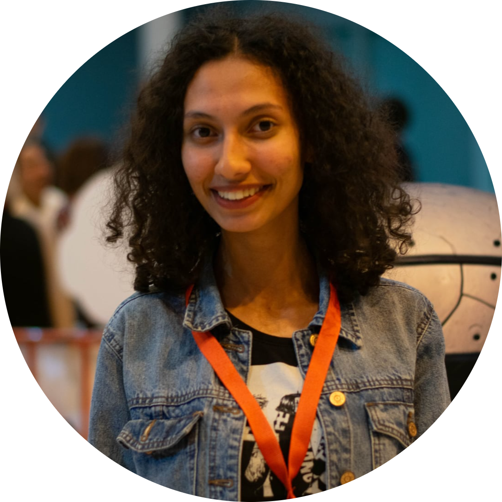

<table style="border-collapse: collapse; border: none;" cellpadding="0" cellspacing="0">
  <tr>
    <td valign="top" width="260" align="center" style="border: none; padding: 0;">
      
    </td>
    <td valign="top" align="left" style="border: none; padding-left: 15px;">

# 👋 Hello, I'm Wided Arfaoui !

🎓 Bachelor in Information Systems Development | Aspiring Software Engineer  
💻 Passionate about Web Development and AI  
🌍 Based in Tunisia  

---

## 🛠️ Skills
- 💡 **Programming**: C, Python, Java, JavaScript  
- 🌐 **Web**: HTML, CSS, React, Node.js, Flask, Spring Boot  
- 📊 **AI/ML**: Sentiment Analysis, Predictive Modeling  
- 🛢️ **Databases**: MySQL, MongoDB  

---

## 🚀 Projects
- 🎲 **Monopoly Game AI** – AI-enhanced Monopoly using C and Flask  
- 📦 **Home Pharmacy App** – Flutter app to manage medicine stock  
- ✈️ **Travel Booking System** – Full-stack booking platform with React & Node.js  
- 🧠 **Recommendations Based on Emotion** – Emotionally intelligent chatbot with personalized suggestions  

---

## 🎯 Hobbies
- 🎨 Drawing & Digital Art  
- 📚 Reading novels & personal development books  
- 🎮 Playing video games  
- 🌱 Exploring AI and new technologies  
- ✈️ Traveling and discovering cultures  

---

## 📫 Connect with Me
- 💼 [LinkedIn](https://www.linkedin.com/in/arfaoui-wided)  
- 📧 Email: widedarfaoui2002@gmail.com

    </td>
  </tr>
</table>
